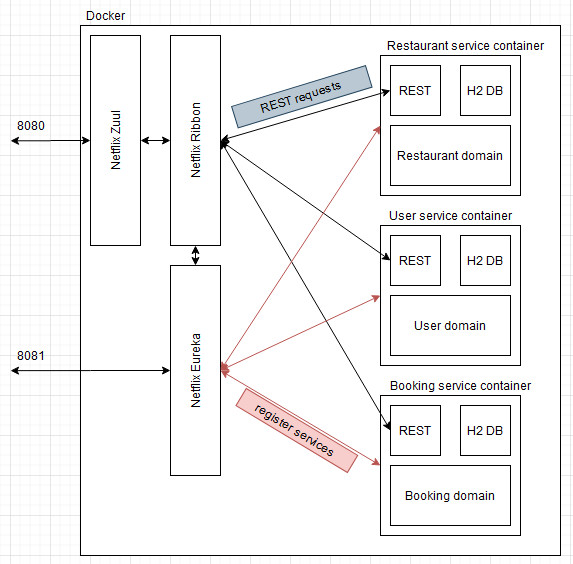

# Restaurant
This project is _microservice application example_.
## How to run  
### Local environment
execute command  
> mvn clean package  

start services in order
1. server-eureka
2. server-zuul
3. service-user
4. service-booking
5. service-restaurant
### Docker environment
execute command
> mvn clean package  
> docker-compose -d up  
 
in repositrory root folder
## Service port for environment
| Service    | Local | Docker |
| :--------- | :---: | :----: |
| Zuul       | 8765  |  8080  |
| Eureka     | 8761  |  8081  |
| Restaurant | 2222  |   -    |
| Booking    | 2223  |   -    |
| User       | 2224  |   -    |
"-" means service is not accessible from outside of Docker  


## Services
### Restaurant
#### JSON structure
```json
{
    "id": null,
    "name": "best name ever",
    "tables": [
        {"capacity": 6},
        {"capacity": 4}
    ]
}
```
#### Endpoints
| REST | Description            | Local                                | Docker                                             | Request param |
| :--- | :--------------------- | :----------------------------------- | :------------------------------------------------- | :-----------: |
| GET  | get all restaurants    | localhost:2222\v1\restaurants        | localhost:8080\restaurantapi\v1\restaurants        |       -       |
| GET  | get restaurant by name | localhost:2222\v1\restaurants\byname | localhost:8080\restaurantapi\v1\restaurants\byname |     name      |
| GET  | get restaurant by id   | localhost:2222\v1\restaurants\{id}   | localhost:8080\restaurantapi\v1\restaurants\{id}   |       -       |
| POST | add restaurant         | localhost:2222\v1\restaurants        | localhost:8080\restaurantapi\v1\restaurants        |       -       |

### Booking
#### JSON structure
```json
{
    "id": null,
    "restaurantId": "1",
    "userId": "1",
    "date": "20-12-2020",
    "time": "16:45",
    "tableId": "5"
}
```
#### Endpoints
| REST | Description        | Local                            | Docker                                      | Request param |
| :--- | :----------------- | :------------------------------- | :------------------------------------------ | :-----------: |
| GET  | get bookingby name | localhost:2224\v1\booking\byname | localhost:8080\bookingapi\v1\booking\byname |     name      |
| GET  | get booking by id  | localhost:2224\v1\booking\{id}   | localhost:8080\bookingapi\v1\booking\{id}   |       -       |
| POST | add booking        | localhost:2224\v1\booking        | localhost:8080\bookingapi\v1\booking        |       -       |

### User
#### JSON structure
```json
{
    "id": null,
    "name": "Pawel Siwon",
    "address": "Big Street",
    "city": "Kielce",
    "phoneNo": "555434343"
}
```
#### Endpoints
| REST | Description      | Local                         | Docker                                | Request param |
| :--- | :--------------- | :---------------------------- | :------------------------------------ | :-----------: |
| GET  | get user by name | localhost:2224\v1\user\byname | localhost:8080\userapi\v1\user\byname |     name      |
| GET  | get user by id   | localhost:2224\v1\user\{id}   | localhost:8080\userapi\v1\user\{id}   |       -       |
| POST | add user         | localhost:2224\v1\user        | localhost:8080\userapi\v1\user        |       -       |

## TODO in near future
 - *Hystrix*
 - *Netflix Turbine*
